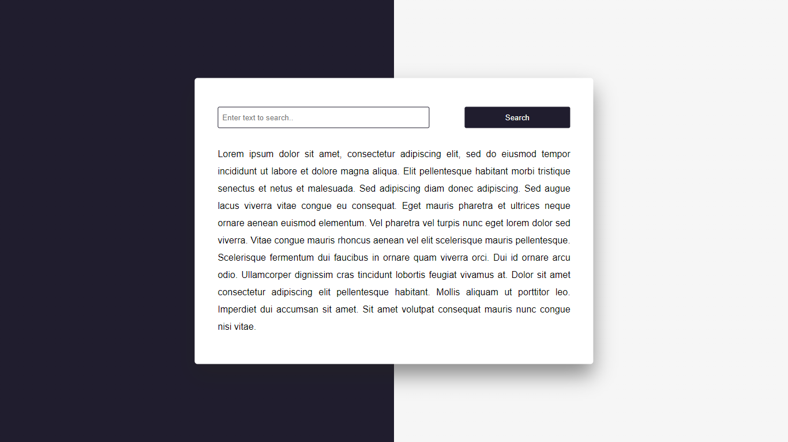

# Highlight-Searched-Text
<h5>EN - Highlighted text highlighter with search using HTML - CSS and vanilla Javascript.</h5>
<h5>PT - Marcador de texto com destaque com pesquisa usando HTML - CSS e Javascript vanilla.</h5>
<h4>Deploy: https://johnandrade65.github.io/Highlight-Searched-Text/</h4>


 
  
  
  
</div
